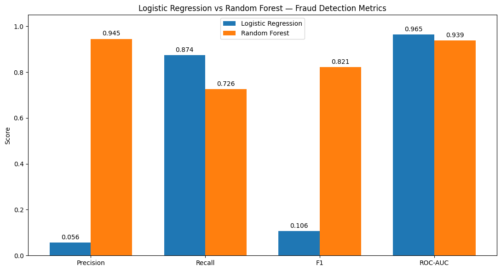

# Credit-card-fraud-detection-ml
Machine learning project for detecting fraudulent credit card transactions using Logistic Regression and Random Forest.
# Visual Results

### LOGISTIC REGRESSION vs RANDOM FOREST

### THRESHOLD vs BUSINESS COST

